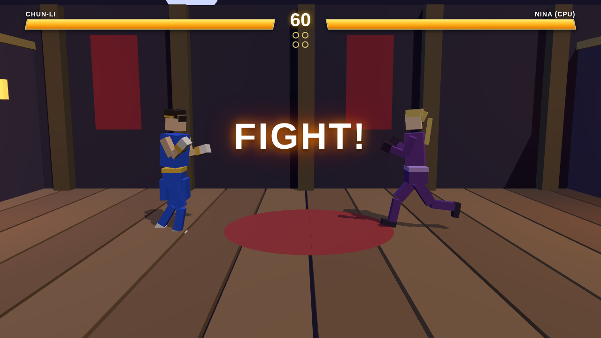

# SF vs TK — 3D Fighting Game Prototype

스트리트 파이터 × 철권 스타일의 웹 기반 3D 대전 격투게임 프로토타입입니다.
Three.js로 제작되었으며 빌드 과정 없이 정적 서버만으로 바로 실행됩니다.



## 실행 방법

```bash
# 저장소 루트에서 아무 정적 서버나 실행
python3 -m http.server 8000
# 또는
npx serve .
```

브라우저에서 `http://localhost:8000` 접속 → 타이틀에서 **1** (VS CPU) 또는 **2** (2인 대전).

## 캐릭터

| | CHUN-LI (SF) | NINA (TK) |
|---|---|---|
| 스타일 | 스피드 · 다단히트 · 장풍 견제 | 한방 데미지 · 벽 운반 · 잡기 |
| 스킬(중립) | **기공권** — 장풍 | **블론드 밤** — 초대형 넉백 (벽꽝 유발) |
| 앞+스킬 | **천승각** — 무적 대공 런처 | **디바인 캐논** — 런처 킥 |
| 뒤+스킬 | **백열각** — 전진 4히트 연각 | **아이보리 커터** — 회피 백플립 런처 |
| ↓+스킬 | **회전각** — 하단 다운 스윕 | **스위핑 로우** — 전진 하단 스윕 |

## 조작 (철권식 4버튼)

| | P1 (춘리) | P2 (니나) |
|---|---|---|
| 이동 / 점프 / 앉기 | A D / W / S | ← → / ↑ / ↓ |
| 펀치 | J | Numpad1 또는 N |
| 킥 | K | Numpad2 또는 M |
| 스킬 | L | Numpad3 또는 , |
| 잡기 | I | Numpad5 또는 B |

- **가드**: 상대 반대 방향 홀드 (상단·중단 방어)
- **앉아 가드**: ↓ + 반대 방향 (하단 방어 / 상단 회피 — 중단에 뚫림)
- **잡기**: 가드 불능 — 가드 굳히기에 대한 답
- **스킬 캔슬**: 잽 히트/가드 시 스킬로 캔슬 가능 (잽잽 → 런처 콤보)
- **일시정지 / 조작표**: P

## 시스템 (공방·타격감)

- 철권식 가드 상성: 상단(앉으면 회피) / 중단(서서 가드) / 하단(앉아 가드) / 특수중단
- **카운터 히트** — 상대 공격 도중 타격 시 데미지·경직 보너스
- **저글 콤보** — 런처로 띄운 후 추가타 (데미지 스케일링 적용)
- **벽꽝(Wall Splat)** — 좌우 벽으로 강하게 날리면 벽에 박힘 → 벽콤보 가능
- **바운드** — 강한 낙하 시 바닥 바운드로 추가 저글 기회
- 히트스톱, 화면 흔들림, 히트 스파크, 잔상, 데미지 표기, KO 슬로모션
- 라운드제 (2선승, 60초 타이머), 칩 데미지 (필살기 가드 시)
- WebAudio 신디사이즈 효과음 (외부 에셋 없음)

## 프로젝트 구조

```
index.html      # UI 오버레이 + import map
vendor/         # three.js (벤더링, 빌드 불필요)
src/
  main.js       # 부트스트랩 · 카메라 · 메인 루프
  game.js       # 판정 · 가드 상성 · 저글 · 벽꽝 · 투사체 · 라운드
  fighter.js    # 캐릭터 상태머신 (이동/공격/피격/다운)
  moves.js      # 프레임 데이터 + 포즈 키프레임 (기술 정의)
  rig.js        # 절차적 휴머노이드 리그 + 포즈 시스템
  ai.js         # CPU 대전 AI (거리별 전술 · 반응 가드 · 대공)
  fx.js         # 히트스톱 · 셰이크 · 파티클 · 잔상
  stage.js      # 3D 도장 스테이지 (좌우 벽)
  audio.js      # WebAudio 신디사이즈 SFX
  ui.js         # 체력바 · 콤보 카운터 · 어나운스
test/           # Playwright 자동 플레이테스트
```

## 테스트

```bash
npm install          # playwright (테스트 전용)
python3 -m http.server 8321 &
node test/smoke.mjs      # 부팅 + 기본 조작
node test/playtest.mjs   # KO → 라운드 → 매치 종료 플로우
node test/wallsplat.mjs  # 벽꽝 + 벽콤보 검증
```

> 캐릭터 외형·기술명은 기존 격투게임에 대한 오마주로, 박스 기반 로우폴리로 재해석한 프로토타입입니다.
